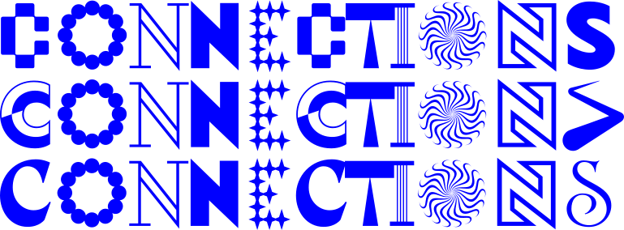
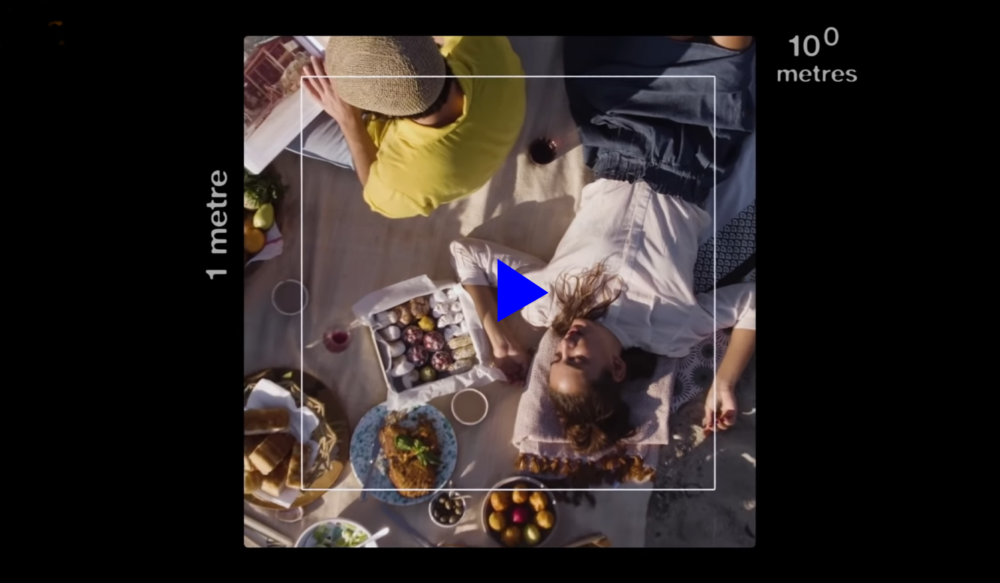

[CSM MAID](https://www.arts.ac.uk/subjects/3d-design-and-product-design/postgraduate/ma-industrial-design-csm) x [Very Very Far Away](https://vvfa.space)

> The details are not the details, they make the product, just as details make the architecture — the gauge of the wire, the selection of the wood, the finish of the castings — the connections,the connections, the connections.

Charles Eames, quoted in Massey, A., _Interior Design of the 20th Century_, New York, Thames and Hudson, 1990, 145–62.

---

# BACKGROUND

When [Charles Eames](https://en.wikipedia.org/wiki/Charles_Eames) said the above, he was alluding to the relationship between elements of design detailing in a piece of office furniture. On a bigger scale, he meant this as a metaphor for the process of design as a whole. 

The concept of **_connections_** is closely related to common theories of **_creativity_**, and is fundamental to the production of design work in particular. 

Design as a process is very much concerned with the location, formation or exploitation of connections. Connections between what? Connections between disciplines such as design and architecture, music and performance, philosophy and physics; connections between objects; connections between departments; connections between institutions; connections between people and machines; connections between markets and consumers; connections between individuals and environments, subjects and objects. 

The connections between individuals on a course such as MAID is one of the primary defining characteristics of your learning experience. Coming from such a vast range of backgrounds and cultures, you have much to learn from each other. In undertaking this project, you will create symbolic links between individuals that will come to represent your group in dynamic terms. 

The project is intended to get you to work together as a team to create something that represents your MAID cohort. But importantly, connections also function as an introduction to the workshops, where you will work with the technical staff who you will engage throughout the course. The project will make you familiar with the workshop working practices and the materials and processes available to you.

# BRIEF

You have been given a group and a number, as well as a list of action verb. Number 1 will initiate a chain reaction by creating a mechanism that will trigger a second device created by 2, then 3 and so on until the final member. You should produce your mechanism using materials and processes accessed in the college workshops.